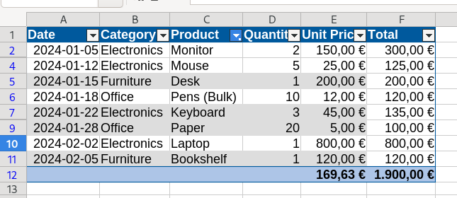

# LibreOffice Knowledge Base

My missing manual on [LibreOffice](https://www.libreoffice.org/).
Check also the [LibreOffice Bookshelf](https://books.libreoffice.org/en/).

## Tables

While LibreOffice Calc does not have a single ["Format as Table" command identical to
Microsoft Excel](https://support.microsoft.com/en-us/office/overview-of-excel-tables-7ab0bb7d-3a9e-4b56-a3c9-6c94334e492c),
it achieves the same functional parity through a combination of **AutoFilters**,
**Database Ranges**, and **AutoFormat Styles**.

### 1. Initial Data Preparation

Before applying table-like features, ensure your data is structured correctly:

* **Header Row:** The first row must contain unique labels for each column.
* **Contiguity:** Ensure there are no completely empty rows or columns within the
  data block.
* **Data Types:** Ensure columns contain consistent data types (e.g., all dates,
  all currency) to prevent filtering errors.

### 2. Enabling Interactive Filtering (AutoFilter)

The most recognizable feature of an Excel table is the drop-down arrow in the header.
In Calc, this is handled by the **AutoFilter** tool.

**Procedure:**

1. Select any cell within your data range.
2. Navigate to **Data > Filter > AutoFilter** in the main menu, or use the shortcut
   `Ctrl + Shift + L`.
3. Calc will automatically detect the boundaries of your data and apply drop-down
   menus to the header row.

> **Note:** Unlike Excel, applying an AutoFilter in Calc does not automatically apply
> zebra-stripe formatting. This must be done as a separate step (see Section 4).
>
> **Multiple AutoFilters on the same sheet:** If you need independent AutoFilters on
> different data blocks within the same sheet, you must first define a Database Range
> for each block (see Section 3), then apply AutoFilter while the cursor is within each
> named range.

### 3. Defining Database Ranges

To make your "table" recognizable to other parts of the program (like Pivot Tables or
specific formulas) and to ensure it behaves as a single entity, you should define it as
a **Database Range**.

**Procedure:**

1. Highlight the entire range of your data, including headers.
2. Go to **Data > Define Range...**.
3. In the dialog box, provide a **Name** for your table (e.g., `SalesData_2024`).
4. Expand the **Options** section and ensure "Contains column headers" is checked.
5. Click **Add** and then **OK**.

To update an existing range (e.g., after adding columns), return to **Data > Define
Range...**, select the range name from the list, adjust the reference in the range
field, and click **Modify**.

### 4. Applying Visual Styles (AutoFormat)

To replicate the "Table Styles" look (banded rows, bold headers, borders), Calc uses
the **AutoFormat Styles** tool.

> **Prerequisite:** Your selection must span **at least 3 columns and 3 rows**,
> otherwise the AutoFormat Styles option will be greyed out in the menu.

**Procedure:**

1. Highlight your data range (minimum 3×3 cells).
2. Navigate to **Format > AutoFormat Styles...**.
3. Choose a preset from the list (e.g., "Blue", "Gray", or "Yellow").
4. Click **OK**.

**Creating a custom AutoFormat style:**

If you wish to save your own style for reuse, manually format a cell range of **at
least 4×4 cells**, then highlight it and click **Add** in the AutoFormat Styles dialog.
Enter a name and click **OK**.

> **Important:** AutoFormat applies **direct formatting**, not cell styles. The saved
> AutoFormat is stored in your user profile, meaning it will be available across
> documents on your machine but will not travel with a shared document to another user.

### 5. Managing and Expanding the Table

One common concern when transitioning from Excel is how the table handles new data.

* **Dynamic Expansion:** If you have defined a **Database Range**, insert new rows
  within the range (right-click a row header > **Insert Rows Above**) to maintain
  formatting and formula integrity. To extend the named range itself, use
  **Data > Define Range...** and update the range reference.
* **Sorting:** Once AutoFilter is active, you can sort by clicking the drop-down arrows
  in the header. For complex multi-column sorts, use **Data > Sort...**.
* **Total Row:** Calc does not have a "Total Row" toggle checkbox. To replicate this,
  use the `SUBTOTAL` function at the bottom of your columns. This ensures that totals
  update dynamically based on your active filters.

### 6. Adding Rows and Maintaining Formatting

Adding rows to a table in Calc requires a couple of manual steps, as formatting is
not automatically extended to new rows the way it is in Excel.

**Adding the row:**

1. Right-click a row number *inside* the table (not below it) and choose
   **Insert Rows Above** — this keeps the row within any defined Database Range.
2. If your Database Range no longer covers the new row, go to
   **Data > Define Range...**, select the range name, update the cell reference,
   and click **Modify**.

**Fixing broken formatting:**

Since AutoFormat applies direct formatting rather than a live style, new rows will
not automatically inherit banded formatting. You have two options:

* **Quick fix:** Re-select the entire table and re-run **Format > AutoFormat Styles...**
  to reapply the style to the expanded range.
* **Permanent fix (recommended):** Replace AutoFormat banding with a
  **Conditional Format** that stays live as the table grows:
  1. Select your data range generously, excluding the header row (e.g. `A2:Z1000`).
  2. Go to **Format > Conditional > New Condition...**.
  3. Set the condition type to **Formula is** and enter `=MOD(ROW(),2)=0`.
  4. Click **New Style...**, choose a background color, and confirm.

  Because this formula is tied to row numbers rather than static formatting, any new
  row added within the range automatically receives the correct stripe color — no
  manual reapplication needed.
